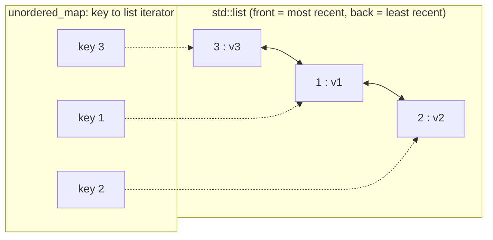
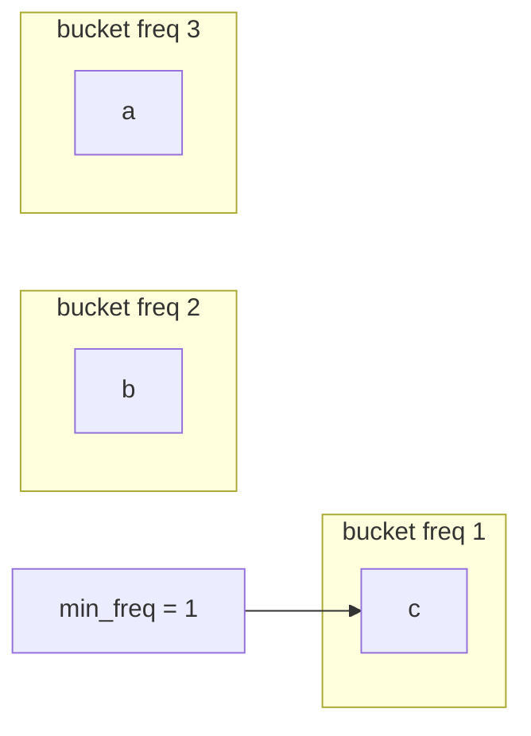

# Thread-Safe LRU & LFU Cache (C++17)


Header-only, from-scratch **LRU** and **LFU** caches with O(1) `get`/`put`/evict, made thread-safe with `std::shared_mutex`, verified with **ThreadSanitizer**, and benchmarked from 1 to 8 threads. A sharded variant sustains roughly **4x the throughput** of a single-lock design at 8 threads.

## Highlights

- **O(1) LRU**: doubly linked list + `unordered_map` of list iterators; recency updates use `splice` (no allocation, no iterator invalidation).
- **O(1) LFU**: frequency buckets (`freq -> list`) + key index + `min_freq` tracking, with LeetCode 460 tie-breaking (least recently used among the least frequent).
- **Thread-safe** via a reader-writer lock: `get`/`put` take an exclusive lock (they mutate recency/frequency state), `peek`/`size`/`contains` take a shared lock.
- **Sharded variant** with per-shard locks, cache-line-aligned shards and a bit-mixing hash.
- **Verified** with differential tests against O(n) reference models, an 8-thread x 100k-op stress test, and ASan/UBSan/TSan builds in CI. TSan reports no data races in the stress test.
- **Proves the detector works**: a deliberately broken variant (`tests/tsan_race_demo.cpp`, a shared lock around the LFU `get`) is flagged by TSan. See [`docs/tsan-race-demo.txt`](docs/tsan-race-demo.txt).

## Benchmark results

Throughput in **million operations per second** (higher is better). Workload: 80% `get` / 20% `put`, uniformly random keys over 8192 keys, capacity 4096 (about 50% hit rate), 500,000 ops per thread, median of 3 runs, Release build (`-O3`).

| Implementation    | 1 thread | 2 threads | 4 threads | 8 threads |
|-------------------|---------:|----------:|----------:|----------:|
| LRU, shared_mutex |    12.78 |      2.95 |      2.28 |      1.59 |
| LFU, shared_mutex |     9.21 |      2.79 |      2.10 |      1.31 |
| LRU, sharded (16) |     9.23 |      5.46 |      7.42 |      6.76 |
| LFU, sharded (16) |     7.43 |      5.84 |      6.63 |      4.87 |

Environment: CPU: AMD Ryzen 5 5500U with Radeon Graphics (12 hardware threads), Ubuntu on WSL2, GCC 15.2.0. Raw output: [`docs/benchmark-results.txt`](docs/benchmark-results.txt). Reproduce with `scripts/run_all.sh`.

**What the numbers show**

- Every configuration clears the 1M ops/sec target at 8 threads.
- With one lock, throughput *drops* as threads are added (12.78 -> 1.59 Mops/s for LRU). Operations are very short (about 80 ns), so the lock and the cache lines it protects bounce between cores, and blocked threads pay for futex sleeps and wake-ups.
- Sharding keeps 3.7 to 4.3x more throughput at 8 threads. It does not scale linearly: every thread still touches every shard, so cache-coherence traffic remains even when locks are not contended. Single-thread speed is lower than the single-lock version because of the hash mixing and extra indirection.
- LFU is slower than LRU because each access moves an entry between two hash-map-backed structures and creates/destroys buckets.
- 80% of the operations are `get`, which needs the exclusive lock, so the shared (reader) side of the lock is never exercised in this benchmark. See *Design decisions*.

## Quick start

```bash
git clone https://github.com/kriritu/thread-safe-cache.git
cd thread-safe-cache

cmake --preset release && cmake --build --preset release -j
./build/release/bench/bench_cache            # benchmark (optionally: bench_cache 2000000)

cmake --preset tsan && cmake --build --preset tsan -j && ctest --preset tsan
```

Presets: `debug`, `asan` (AddressSanitizer + UBSan), `tsan` (ThreadSanitizer), `release`. `scripts/run_all.sh` runs everything.

**Requirements:** C++17 compiler (GCC 9+ / Clang 10+), CMake 3.21+, Linux or macOS (ThreadSanitizer is not available with MSVC).

## Usage

```cpp
#include "cache/concurrent_cache.hpp"
#include "cache/sharded_cache.hpp"

// Single lock, shared_mutex
cache::ThreadSafeLRUCache<int, std::string> lru(1024);
lru.put(1, "one");
if (auto v = lru.get(1)) { /* *v == "one" */ }

// 16 shards, each with its own lock
cache::ShardedLFUCache<std::string, int> lfu(65536, 16);
lfu.put("hits", 1);
```

| Method | Lock | Notes |
|---|---|---|
| `get(key)` | exclusive | returns `std::optional<V>`; promotes the key |
| `put(key, value)` | exclusive | insert/update; evicts if full; updating counts as an access |
| `peek(key)` | shared | does not change recency/frequency |
| `contains(key)` / `size()` | shared | `size()` of the sharded cache is not an atomic snapshot |
| `capacity()` | none | immutable after construction |

Capacity 0 stores nothing. Values are returned by copy, so use a cheap-to-copy `V` (for example `std::shared_ptr<const T>`) for large objects.

## How it works

### LRU



`get` finds the node through the map and calls `list::splice` to move it to the front. `splice` only relinks pointers, so it is O(1) and every stored iterator stays valid. Eviction removes the back node from the map first, then from the list.

### LFU



Each bucket is a list ordered by recency. An access splices the entry from bucket `f` to `f+1` (O(1)); if bucket `f` empties it is erased and `min_freq` advances when needed. A new key always goes into bucket 1 and resets `min_freq` to 1. Eviction removes the back of the `min_freq` bucket, which is the least recently used among the least frequently used.

### Thread safety

One `std::shared_mutex` guards each cache. Mutating operations hold it exclusively; non-mutating ones share it. There is a single lock and it is never held across calls to user code, so deadlock is impossible. Mutex acquire/release provides the happens-before ordering that ThreadSanitizer checks.

### Sharding

Keys are hashed (with a bit-mixing finalizer, because `std::hash<int>` is the identity) to one of N independent shards, each a locked cache on its own cache line. Threads working on different shards do not block each other. The trade-off is that eviction order is per shard, so the policy is an approximation of global LRU/LFU, and capacity is rounded up to a multiple of the shard count.

## Correctness and verification

| Check | What it covers |
|---|---|
| LeetCode 146 / 460 sequences | exact eviction behaviour, including LFU tie-breaks |
| Differential tests | 100k random operations compared with simple O(n) reference models, several capacities, including 1 |
| Wrapper test | the locked wrapper behaves identically to the unsynchronised cache |
| Stress test | 8 threads x 100k random `get`/`put`/`peek`/`size`, four cache types, two contention levels; every value must equal `f(key)`; final size and contents are validated |
| ASan + UBSan | memory errors and undefined behaviour |
| ThreadSanitizer | no data races reported in the stress test |
| Negative test | `tests/tsan_race_demo.cpp` takes a shared lock in the LFU `get()` on purpose; TSan reports the data race ([output](docs/tsan-race-demo.txt)) |

Tests use a `CHECK` macro rather than `assert`, because `assert` is compiled out in builds with `-DNDEBUG` (including the RelWithDebInfo TSan build).

## Design decisions and trade-offs

- **Why `get` takes the exclusive lock.** In both caches a read updates shared structures (list order, frequency buckets). A shared lock there is a data race, which the TSan demo shows. `shared_mutex` therefore only helps non-mutating calls such as `peek`/`size`, and the benchmark (80% `get`) never uses the shared path. A plain `std::mutex` is likely at least as fast for this workload.
- **Sharding versus exact policy.** Sharding buys scalability at the cost of exact global ordering. For caches, an approximate policy is normally acceptable.
-

exit

